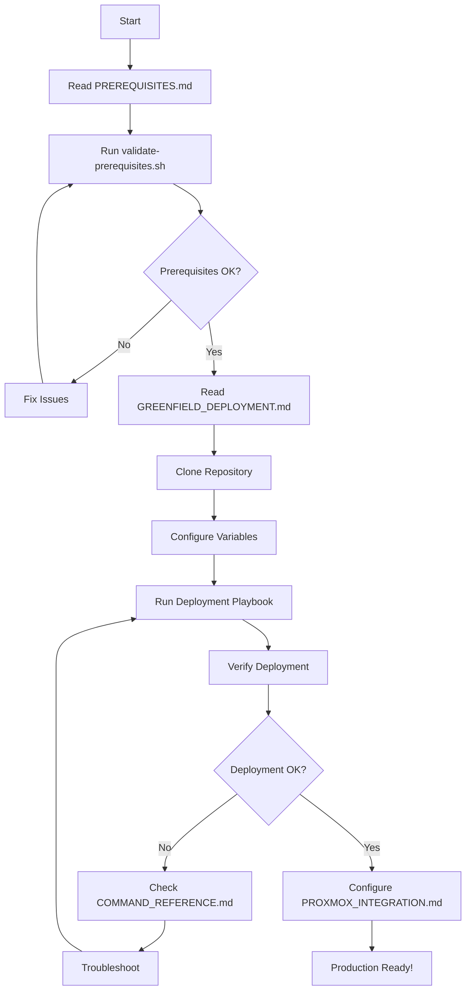

# Documentation Index

Complete documentation for NetBox deployment on Proxmox VE 9.1+.

## Quick Links

- **[SYSTEM_CAPABILITY_ANALYSIS.md](SYSTEM_CAPABILITY_ANALYSIS.md)** - **NEW:** Automated deployment configuration from automation_nation data
- **[PREREQUISITES.md](PREREQUISITES.md)** - Start here! Comprehensive prerequisites and validation
- **[GREENFIELD_DEPLOYMENT.md](GREENFIELD_DEPLOYMENT.md)** - Step-by-step deployment from scratch
- **[ARCHITECTURE.md](ARCHITECTURE.md)** - System architecture and design decisions
- **[COMMAND_REFERENCE.md](COMMAND_REFERENCE.md)** - Command reference for all components
- **[ANSIBLE_DESIGN.md](ANSIBLE_DESIGN.md)** - Ansible automation framework details
- **[PROXMOX_INTEGRATION.md](PROXMOX_INTEGRATION.md)** - Proxmox VE integration and plugin setup

## Documentation Structure

### Getting Started

1. **[SYSTEM_CAPABILITY_ANALYSIS.md](SYSTEM_CAPABILITY_ANALYSIS.md)** - **NEW: Start here for automated configuration**
   - Collect system information with automation_nation
   - Analyze networking, hardware, and software resources
   - Generate optimized deployment configuration
   - Automatic resource allocation based on detected capabilities

2. **[PREREQUISITES.md](PREREQUISITES.md)** - Manual prerequisites checklist
   - Hardware requirements (reference: [automation_nation.git](https://github.com/nullroute-commits/automation_nation.git))
   - Software requirements
   - Network requirements
   - Prerequisites validation script

3. **[GREENFIELD_DEPLOYMENT.md](GREENFIELD_DEPLOYMENT.md)** - Deployment guide
   - Quick start instructions
   - Detailed deployment phases
   - Troubleshooting common issues
   - Post-deployment configuration

### Architecture & Design

3. **[ARCHITECTURE.md](ARCHITECTURE.md)** - System architecture
   - Three-tier network design
   - Container layout and specifications
   - Security considerations
   - High availability options

4. **[ANSIBLE_DESIGN.md](ANSIBLE_DESIGN.md)** - Automation framework
   - Project structure
   - Role descriptions
   - Variable organization
   - Best practices

### Operations & Reference

5. **[COMMAND_REFERENCE.md](COMMAND_REFERENCE.md)** - Command reference
   - Container management
   - Service management
   - Troubleshooting commands
   - Maintenance procedures

6. **[PROXMOX_INTEGRATION.md](PROXMOX_INTEGRATION.md)** - Proxmox integration
   - NetBox Proxmox plugin setup
   - API configuration
   - Synchronization procedures

## Hardware Specifications

Use the [automation_nation.git](https://github.com/nullroute-commits/automation_nation.git) bash script to collect comprehensive hardware and software information from your Proxmox node:

```bash
# On Proxmox host
git clone https://github.com/nullroute-commits/automation_nation.git
cd automation_nation
./collect_info.sh -o node_info.json
```

This script collects:
- CPU architecture and virtualization support
- Memory and swap configuration
- Storage devices and capacity
- Network interfaces
- Installed packages and versions
- System metrics and uptime

## Documentation Overview

### PREREQUISITES.md
**Purpose:** Ensure your system meets all requirements before deployment

**Key Sections:**
- Hardware requirements and validation
- Software requirements (Proxmox, Ansible, Python)
- Network requirements and configuration
- Pre-deployment validation script
- Troubleshooting common prerequisite issues

**When to Read:** Before starting any deployment

### GREENFIELD_DEPLOYMENT.md
**Purpose:** Step-by-step guide for deploying from scratch

**Key Sections:**
- Prerequisites checklist
- Quick start guide (30-45 minutes)
- Detailed deployment phases
- Customization options
- Post-deployment steps
- Troubleshooting deployment issues

**When to Read:** During deployment process

### ARCHITECTURE.md
**Purpose:** Understand the system design and architecture

**Key Sections:**
- Network design (three-tier architecture)
- Container specifications
- Security features
- Technology stack details
- Operational considerations
- Scalability and high availability

**When to Read:** 
- Before deployment (to understand what will be built)
- When planning modifications or customizations
- When troubleshooting complex issues

### ANSIBLE_DESIGN.md
**Purpose:** Understand the Ansible automation framework

**Key Sections:**
- Project structure and organization
- Role descriptions and dependencies
- Variable hierarchy
- Playbook design
- Testing and validation
- Contributing to automation

**When to Read:**
- When modifying or extending playbooks
- When contributing to the project
- When troubleshooting automation issues

### COMMAND_REFERENCE.md
**Purpose:** Quick reference for common operations

**Key Sections:**
- Proxmox container management
- Service management (NetBox, PostgreSQL, Nginx, Valkey)
- Database operations
- Backup and restore procedures
- Monitoring and logging
- Troubleshooting commands

**When to Read:**
- During day-to-day operations
- When troubleshooting issues
- When performing maintenance

### PROXMOX_INTEGRATION.md
**Purpose:** Configure NetBox-Proxmox integration

**Key Sections:**
- NetBox Proxmox plugin installation
- API token configuration
- Synchronization setup
- Usage examples
- Troubleshooting integration issues

**When to Read:**
- After deployment is complete
- When setting up Proxmox inventory in NetBox

## Additional Resources

### In Repository
- **[../README.md](../README.md)** - Main project README
- **[../VERSIONS.md](../VERSIONS.md)** - Software versions and compatibility
- **[../CONTRIBUTING.md](../CONTRIBUTING.md)** - Contributing guidelines
- **[../scripts/README.md](../scripts/README.md)** - Utility scripts documentation

### External Resources
- **[automation_nation.git](https://github.com/nullroute-commits/automation_nation.git)** - Hardware specifications and deployment patterns
- **[NetBox Documentation](https://docs.netbox.dev/)** - Official NetBox documentation
- **[Proxmox VE Documentation](https://pve.proxmox.com/pve-docs/)** - Official Proxmox documentation
- **[Ansible Documentation](https://docs.ansible.com/)** - Official Ansible documentation

## Quick Start Workflow



## Support & Contributing

- **Issues:** Report bugs or request features via GitHub issues
- **Contributing:** See [CONTRIBUTING.md](../CONTRIBUTING.md)
- **Questions:** Check existing documentation first, then create an issue

## Version Information

- **Proxmox VE:** 9.1+ (9.0+ supported)
- **Documentation Version:** December 2025
- **Last Updated:** December 7, 2025

## License

All documentation is licensed under MIT License - see [LICENSE](../LICENSE)

---

**Need Help?**
1. Check the relevant documentation section
2. Run validation scripts (in ../scripts/)
3. Review COMMAND_REFERENCE.md for troubleshooting
4. Search existing GitHub issues
5. Create a new issue with detailed information
